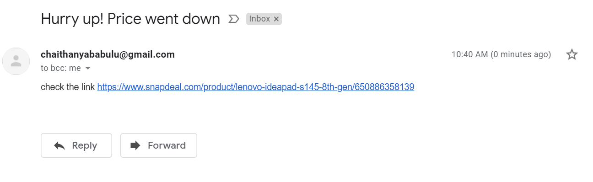

# Snapdeal-Ecommerce-_Webscrapper
Web Scraping is a technique employed to extract large amounts of data from websites whereby the data is extracted and saved to a local file in your computer or to a database like MongoDB.

The three main components of web scraping are :

In this project, I have scrapped the Snapdeal E-commerce website product price and it tracks the product price. An email alert will be sent to the user when ever the price of the product is low (upon providing price threshold) and user can save his money for the product wished to purchase. I have used Python to track the product prices from the website and libraries like BeautifulSoup and Requests. BeautifulSoup enables us to extract data and parse  HTML and XML documents.

Email Alert sent to user: 

Below are the tools and libraries used to extract the data from website:

1. Language : Python
2. Libraries : BeautifulSoup, Requests
